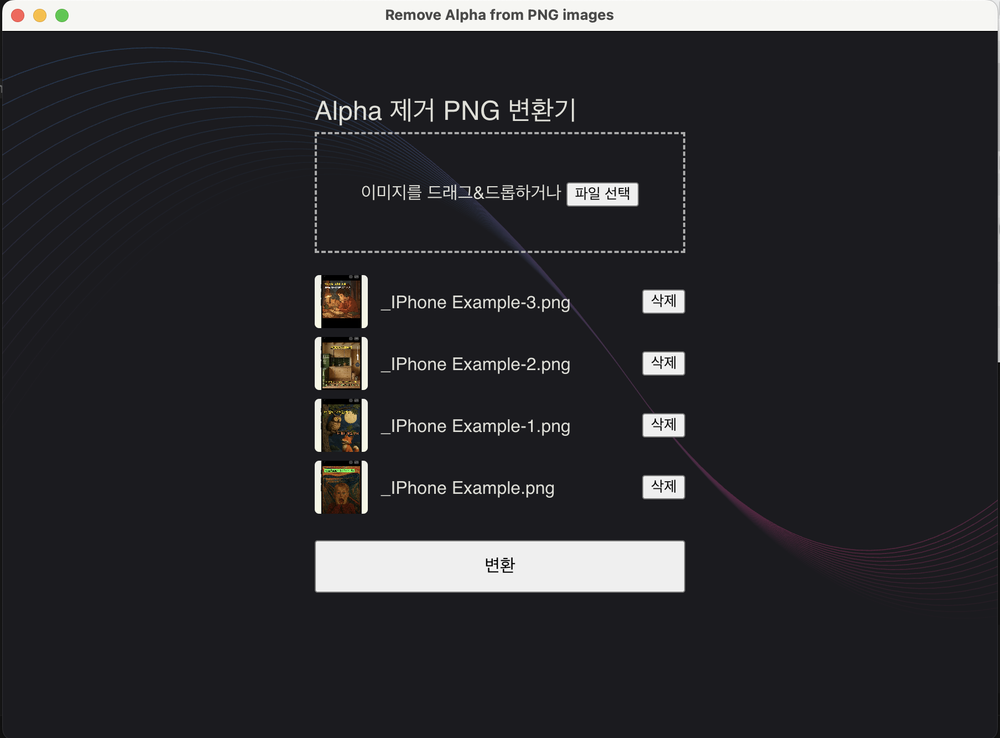

# 이미지 알파 채널 제거 도구 (Remove Alpha From Images)

PNG 파일에서 알파(투명도) 값을 제거하는 간편한 데스크톱 애플리케이션입니다.



## 주요 기능

- 드래그 앤 드롭으로 이미지 파일 업로드
- 파일 브라우저를 통한 이미지 선택
- 한 번의 클릭으로 알파 채널 제거
- 처리된 이미지 즉시 다운로드

## 사용 방법

1. 애플리케이션을 실행합니다.
2. 이미지 파일을 드래그 앤 드롭하거나 파일 선택 버튼을 통해 선택합니다.
3. '변환' 버튼을 클릭합니다.
4. 알파 값이 제거된 이미지가 자동으로 다운로드됩니다.

## 지원 형식

- PNG 이미지 파일

## 개발 환경 설정

### 필수 요구 사항

- [Node.js](https://nodejs.org/) 14 이상
- npm 또는 yarn

### 설치

```bash
# 의존성 설치
$ npm install
```

### 개발 모드 실행

```bash
# 개발 서버 실행
$ npm run dev
```

### 빌드

```bash
# Windows용 빌드
$ npm run build:win

# macOS용 빌드
$ npm run build:mac

# Linux용 빌드
$ npm run build:linux
```

## 기술 스택

- Electron
- React
- TypeScript
- Sharp (이미지 처리)

## 라이선스

MIT

## 기여하기

1. 이 저장소를 포크합니다
2. 새 브랜치를 생성합니다 (`git checkout -b feature/amazing-feature`)
3. 변경 사항을 커밋합니다 (`git commit -m 'Add some amazing feature'`)
4. 브랜치에 푸시합니다 (`git push origin feature/amazing-feature`)
5. Pull Request를 생성합니다
